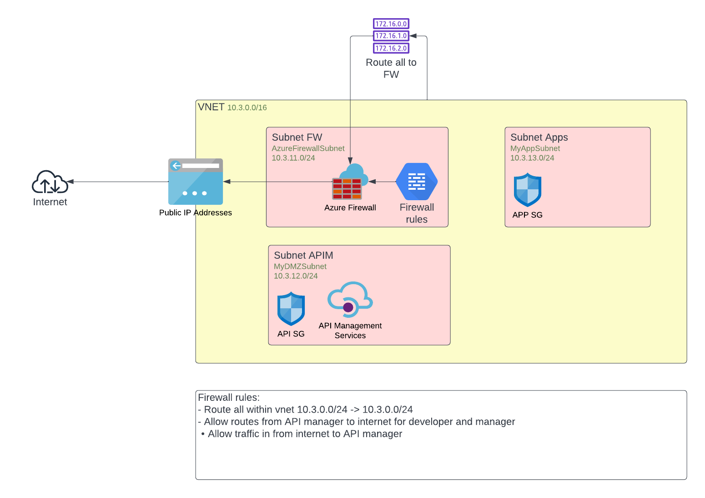

# Goal 

This is PoC setup with an API manager in conjunction with an Azure firewall. 
The setup is an API manager with several subnets in a VNet from where all traffic is routed through the Azure firewall. 



## Stack 
- Terraform 1.2+
- CDKTF version 0.11.2+
- Make 
- Typescript 4.7.4
- Developed on GNOME 4.3 and on MacOS 12 on M1
- Azure cli 2.38.0+
- Admin account on an Azure subscription

# Usage 

Install the stack and then login to the azure account you will use
```bash
az login 
```

Initialize the project 

```bash
make cdk_get 
```

Then deploy the stack  
(Note this will take about an hour)

```bash 
make cdk_deploy 
```

When done clean up with 

```bash
make cdk_destroy
```

(Or delete the resource group in the portal.)

# Settings 

Getting ms addresses from this article: 

https://techcommunity.microsoft.com/t5/azure-paas-blog/api-management-networking-faqs-demystifying-series-ii/ba-p/1502056

